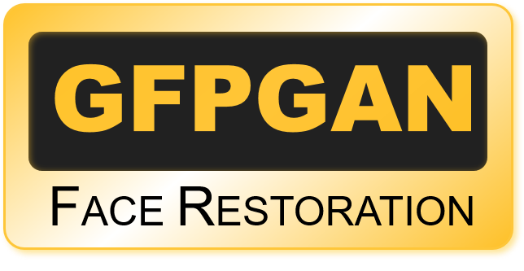

<p align="center">
  
</p>

## <div align="center"><b><a href="README.md">English</a> | <a href="README_CN.md">简体中文</a></b></div>

<div align="center">
<!-- <a href="https://twitter.com/_Xintao_" style="text-decoration:none;">
    
</a> -->

[](https://github.com/TencentARC/GFPGAN/releases)
[](https://pypi.org/project/gfpgan/)
[](https://github.com/TencentARC/GFPGAN/issues)
[](https://github.com/TencentARC/GFPGAN/issues)
[](https://github.com/TencentARC/GFPGAN/blob/master/LICENSE)
[](https://github.com/TencentARC/GFPGAN/blob/master/.github/workflows/pylint.yml)
[](https://github.com/TencentARC/GFPGAN/blob/master/.github/workflows/publish-pip.yml)
</div>

1. :boom: **Updated** online demo: [](https://replicate.com/tencentarc/gfpgan). Here is the [backup](https://replicate.com/xinntao/gfpgan).
1. :boom: **Updated** online demo: [](https://huggingface.co/spaces/Xintao/GFPGAN)
1. [Colab Demo](https://colab.research.google.com/drive/1sVsoBd9AjckIXThgtZhGrHRfFI6UUYOo) for GFPGAN <a href="https://colab.research.google.com/drive/1sVsoBd9AjckIXThgtZhGrHRfFI6UUYOo"></a>; (Another [Colab Demo](https://colab.research.google.com/drive/1Oa1WwKB4M4l1GmR7CtswDVgOCOeSLChA?usp=sharing) for the original paper model)

<!-- 3. Online demo: [Replicate.ai](https://replicate.com/xinntao/gfpgan) (may need to sign in, return the whole image)
4. Online demo: [Baseten.co](https://app.baseten.co/applications/Q04Lz0d/operator_views/8qZG6Bg) (backed by GPU, returns the whole image)
5. We provide a *clean* version of GFPGAN, which can run without CUDA extensions. So that it can run in **Windows** or on **CPU mode**. -->

> :rocket: **Thanks for your interest in our work. You may also want to check our new updates on the *tiny models* for *anime images and videos* in [Real-ESRGAN](https://github.com/xinntao/Real-ESRGAN/blob/master/docs/anime_video_model.md)** :blush:

GFPGAN aims at developing a **Practical Algorithm for Real-world Face Restoration**.<br>
It leverages rich and diverse priors encapsulated in a pretrained face GAN (*e.g.*, StyleGAN2) for blind face restoration.

:question: Frequently Asked Questions can be found in [FAQ.md](FAQ.md).

:triangular_flag_on_post: **Updates**

- :white_check_mark: Add [RestoreFormer](https://github.com/wzhouxiff/RestoreFormer) inference codes.
- :white_check_mark: Add [V1.4 model](https://github.com/TencentARC/GFPGAN/releases/download/v1.3.0/GFPGANv1.4.pth), which produces slightly more details and better identity than V1.3.
- :white_check_mark: Add **[V1.3 model](https://github.com/TencentARC/GFPGAN/releases/download/v1.3.0/GFPGANv1.3.pth)**, which produces **more natural** restoration results, and better results on *very low-quality* / *high-quality* inputs. See more in [Model zoo](#european_castle-model-zoo), [Comparisons.md](Comparisons.md)
- :white_check_mark: Integrated to [Huggingface Spaces](https://huggingface.co/spaces) with [Gradio](https://github.com/gradio-app/gradio). See [Gradio Web Demo](https://huggingface.co/spaces/akhaliq/GFPGAN).
- :white_check_mark: Support enhancing non-face regions (background) with [Real-ESRGAN](https://github.com/xinntao/Real-ESRGAN).
- :white_check_mark: We provide a *clean* version of GFPGAN, which does not require CUDA extensions.
- :white_check_mark: We provide an updated model without colorizing faces.

---

If GFPGAN is helpful in your photos/projects, please help to :star: this repo or recommend it to your friends. Thanks:blush:
Other recommended projects:<br>
:arrow_forward: [Real-ESRGAN](https://github.com/xinntao/Real-ESRGAN): A practical algorithm for general image restoration<br>
:arrow_forward: [BasicSR](https://github.com/xinntao/BasicSR): An open-source image and video restoration toolbox<br>
:arrow_forward: [facexlib](https://github.com/xinntao/facexlib): A collection that provides useful face-relation functions<br>
:arrow_forward: [HandyView](https://github.com/xinntao/HandyView): A PyQt5-based image viewer that is handy for view and comparison<br>

---

### :book: GFP-GAN: Towards Real-World Blind Face Restoration with Generative Facial Prior

> [[Paper](https://arxiv.org/abs/2101.04061)] &emsp; [[Project Page](https://xinntao.github.io/projects/gfpgan)] &emsp; [Demo] <br>
> [Xintao Wang](https://xinntao.github.io/), [Yu Li](https://yu-li.github.io/), [Honglun Zhang](https://scholar.google.com/citations?hl=en&user=KjQLROoAAAAJ), [Ying Shan](https://scholar.google.com/citations?user=4oXBp9UAAAAJ&hl=en) <br>
> Applied Research Center (ARC), Tencent PCG

<p align="center">
  
</p>

---

## :wrench: Dependencies and Installation

- Python >= 3.7 (Recommend to use [Anaconda](https://www.anaconda.com/download/#linux) or [Miniconda](https://docs.conda.io/en/latest/miniconda.html))
- [PyTorch >= 1.7](https://pytorch.org/)
- Option: NVIDIA GPU + [CUDA](https://developer.nvidia.com/cuda-downloads)
- Option: Linux

### Installation

We now provide a *clean* version of GFPGAN, which does not require customized CUDA extensions. <br>
If you want to use the original model in our paper, please see [PaperModel.md](PaperModel.md) for installation.

1. Clone repo

    ```bash
    git clone https://github.com/TencentARC/GFPGAN.git
    cd GFPGAN
    ```

1. Install dependent packages

    ```bash
    # Install basicsr - https://github.com/xinntao/BasicSR
    # We use BasicSR for both training and inference
    pip install basicsr

    # Install facexlib - https://github.com/xinntao/facexlib
    # We use face detection and face restoration helper in the facexlib package
    pip install facexlib

    pip install -r requirements.txt
    python setup.py develop

    # If you want to enhance the background (non-face) regions with Real-ESRGAN,
    # you also need to install the realesrgan package
    pip install realesrgan
    ```

## :zap: Quick Inference

We take the v1.3 version for an example. More models can be found [here](#european_castle-model-zoo).

Download pre-trained models: [GFPGANv1.3.pth](https://github.com/TencentARC/GFPGAN/releases/download/v1.3.0/GFPGANv1.3.pth)

```bash
wget https://github.com/TencentARC/GFPGAN/releases/download/v1.3.0/GFPGANv1.3.pth -P experiments/pretrained_models
```

**Inference!**

```bash
python inference_gfpgan.py -i inputs/whole_imgs -o results -v 1.3 -s 2
```

```console
Usage: python inference_gfpgan.py -i inputs/whole_imgs -o results -v 1.3 -s 2 [options]...

  -h                   show this help
  -i input             Input image or folder. Default: inputs/whole_imgs
  -o output            Output folder. Default: results
  -v version           GFPGAN model version. Option: 1 | 1.2 | 1.3. Default: 1.3
  -s upscale           The final upsampling scale of the image. Default: 2
  -bg_upsampler        background upsampler. Default: realesrgan
  -bg_tile             Tile size for background sampler, 0 for no tile during testing. Default: 400
  -suffix              Suffix of the restored faces
  -only_center_face    Only restore the center face
  -aligned             Input are aligned faces
  -ext                 Image extension. Options: auto | jpg | png, auto means using the same extension as inputs. Default: auto
```

If you want to use the original model in our paper, please see [PaperModel.md](PaperModel.md) for installation and inference.

## :european_castle: Model Zoo

| Version | Model Name  | Description |
| :---: | :---:        |     :---:      |
| V1.3 | [GFPGANv1.3.pth](https://github.com/TencentARC/GFPGAN/releases/download/v1.3.0/GFPGANv1.3.pth) | Based on V1.2; **more natural** restoration results; better results on very low-quality / high-quality inputs. |
| V1.2 | [GFPGANCleanv1-NoCE-C2.pth](https://github.com/TencentARC/GFPGAN/releases/download/v0.2.0/GFPGANCleanv1-NoCE-C2.pth) | No colorization; no CUDA extensions are required. Trained with more data with pre-processing. |
| V1 | [GFPGANv1.pth](https://github.com/TencentARC/GFPGAN/releases/download/v0.1.0/GFPGANv1.pth) | The paper model, with colorization. |

The comparisons are in [Comparisons.md](Comparisons.md).

Note that V1.3 is not always better than V1.2. You may need to select different models based on your purpose and inputs.

| Version | Strengths  | Weaknesses |
| :---: | :---:        |     :---:      |
|V1.3 |  ✓ natural outputs<br> ✓better results on very low-quality inputs <br> ✓ work on relatively high-quality inputs <br>✓ can have repeated (twice) restorations | ✗ not very sharp <br> ✗ have a slight change on identity |
|V1.2 |  ✓ sharper output <br> ✓ with beauty makeup | ✗ some outputs are unnatural |

You can find **more models (such as the discriminators)** here: [[Google Drive](https://drive.google.com/drive/folders/17rLiFzcUMoQuhLnptDsKolegHWwJOnHu?usp=sharing)], OR [[Tencent Cloud 腾讯微云](https://share.weiyun.com/ShYoCCoc)]

## :computer: Training

We provide the training codes for GFPGAN (used in our paper). <br>
You could improve it according to your own needs.

**Tips**

1. More high quality faces can improve the restoration quality.
2. You may need to perform some pre-processing, such as beauty makeup.

**Procedures**

(You can try a simple version ( `options/train_gfpgan_v1_simple.yml`) that does not require face component landmarks.)

1. Dataset preparation: [FFHQ](https://github.com/NVlabs/ffhq-dataset)

1. Download pre-trained models and other data. Put them in the `experiments/pretrained_models` folder.
    1. [Pre-trained StyleGAN2 model: StyleGAN2_512_Cmul1_FFHQ_B12G4_scratch_800k.pth](https://github.com/TencentARC/GFPGAN/releases/download/v0.1.0/StyleGAN2_512_Cmul1_FFHQ_B12G4_scratch_800k.pth)
    1. [Component locations of FFHQ: FFHQ_eye_mouth_landmarks_512.pth](https://github.com/TencentARC/GFPGAN/releases/download/v0.1.0/FFHQ_eye_mouth_landmarks_512.pth)
    1. [A simple ArcFace model: arcface_resnet18.pth](https://github.com/TencentARC/GFPGAN/releases/download/v0.1.0/arcface_resnet18.pth)

1. Modify the configuration file `options/train_gfpgan_v1.yml` accordingly.

1. Training

> python -m torch.distributed.launch --nproc_per_node=4 --master_port=22021 gfpgan/train.py -opt options/train_gfpgan_v1.yml --launcher pytorch

## :scroll: License and Acknowledgement

GFPGAN is released under Apache License Version 2.0.

## BibTeX

    @InProceedings{wang2021gfpgan,
        author = {Xintao Wang and Yu Li and Honglun Zhang and Ying Shan},
        title = {Towards Real-World Blind Face Restoration with Generative Facial Prior},
        booktitle={The IEEE Conference on Computer Vision and Pattern Recognition (CVPR)},
        year = {2021}
    }

## :e-mail: Contact

If you have any question, please email `xintao.wang@outlook.com` or `xintaowang@tencent.com`.
